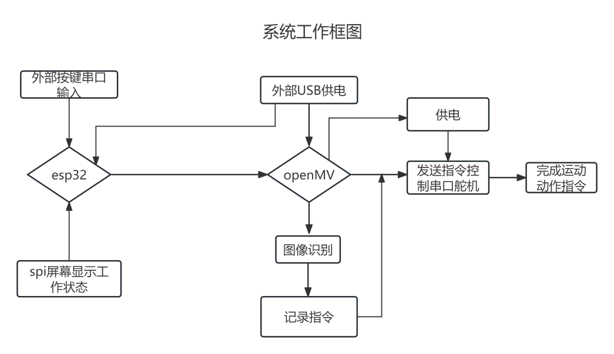
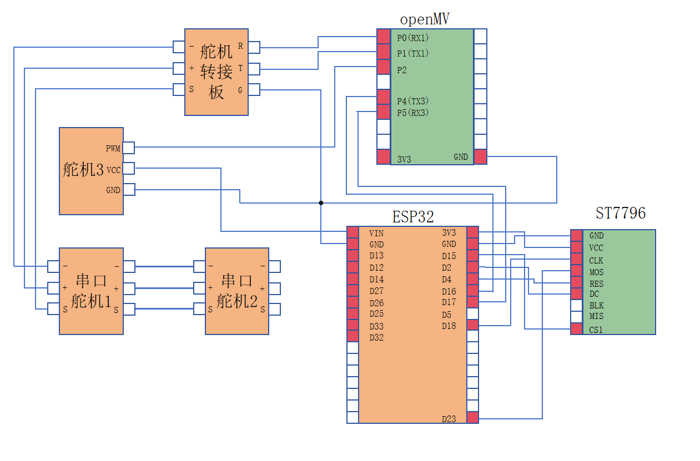

<h1 align='center'>井字棋智能机械臂
</h1>

​	**本系统由四个相互联系协同共同工作的模块构成，其中OpenMV为系统的控制核心，机械运动部分以二维可旋转云台作固定装置，由舵机驱动模块根据OpenMV传输的指令完成工作目标，并由锂电池供电，实现棋盘、棋子坐标的自动识别记忆并完成机器自动抓取放置功能。能够实现的功能有：装置能将任意指定数量的黑白棋子稳定的放置到任意指定方格中；棋盘在顺时针逆时针旋转45度以内时保持正确识别放置。装置在与人类对弈过程中能够始终选择最优决策并可以自动发现人类作弊行为。系统功能由按键控制，有简单的屏幕显示功能，达到了较好的性能指标。**

---

#### Demo:

### 一、总体方案

  

 

​	针对三子棋游戏装置设计，我们提出了一个集成系统方案，该方案由以下关键模块构成：**视觉识别模块、机械臂运动控制模块**以及**按键系统控制**与**指示执行模块**。

#### 1. 视觉识别模块

​	我们选择 OpenMV 作为视觉识别模块的核心控制单元。这是一款专为机器视觉应用设计的微控制器开发板，具备以下显著优势：OpenMV 集成了高性能的视觉处理硬件，能够快速准确地执行图像捕获、处理和分析任务；同时提供了包括目标跟踪、颜色识别和图像滤波在内的多种视觉算法，这些算法经过优化，易于实现和调整。此外，拥有灵活的通信接口：OpenMV 配备有两个UART接口（UART1和UART3），这为系统内各模块间的串行通信提供了便利，增强了系统的逻辑性和协调性。

#### 2. 机械臂运动控制模块

​	机械臂的结构分为水平层面与垂直层面，在水平层面上，我们采用了2个串口总线360度舵机实现两级旋转结构，使其能够满足能够覆盖整个棋盘与棋子摆放范围实现抓取功能并达到题目要求的精度；在垂直层面上，采用了一个9G舵机控制磁铁抓取部分垂直运动，结合机械臂末端的限位结构实现棋子的抓取和放落。

#### 3. 按键控制模块

此部分采用外置方案，使用 esp32 作为中控，通过串口通信与视觉识别模块openMV 进行信息的传递与交换，可以准确的将题目中的各部分要求单独封装到不同函数中进行准确清晰的控制

#### 4. 执行结果显示模块

​	本部分采用主要oled屏幕并利用esp32控制，将视觉识别模块与机械臂运动控制的任务执行状况反映在屏幕中，同时加入灯光控制满足题目对于下棋部分要求的任务执行反馈。

#### 5. 供电

​	我们的openMv与esp32采用充电宝稳定供电，机械臂运动模块部分采用9V锂电池供电。

---

## 二、 视觉识别

​	对于棋盘这类矩形图形的识别，往往采用边缘检测方法，本项目创新性地通过 openMV 的**线条识别方法**来识别棋盘上的黑色网格线条，**所有横纵线条的交点**就得到了所有网格的精确位置坐标。在图像处理过程中，还加入亮度、对比度、增益控制来调整图像的清晰度。此外，对于交叉点和网格中心点坐标还使用了**平均值滤波器**来减小相对误差，并用**帧缓存**来确保稳定的识别输出结果。

​	首先初始化与配置：通过 OpenMV 相机的 Python 接口初始化传感器，设置分辨率、亮度、对比度和增益等参数。通过边缘检测与线条过滤：使用find_lines 方法进行边缘检测，并通过阈值和边距设置过滤线条，实现线条合并功能 merge_lines 以避免错误识别。此外，通过坐标计算与滤波：识别棋盘线条后计算交点坐标，采用平均值滤波器平滑处理顶点坐标，减少噪声影响。

​	对于棋盘位置的识别：根据检测到的线条交点确定棋盘位置，并计算方格中心坐标，为棋子检测提供参考。棋子检测与稳定性检测：在棋盘范围内检测圆形棋子，通过亮度值区分颜色并识别棋子符号。引入多帧稳定性检测机制，确保棋盘和棋子识别结果稳定后进行后续操作。

---

## 三、电路设计与机械结构

- 如下图为整个系统电路工作框图

  

 

- 根据如上图的系统工作流程和方式，对 esp32, OpenMV, st7796 显示屏,以及外接按键做如下电路连接，实现对应的设计功能

  

 

​	我们通过一个二维云台作为机械臂第一级结构的支架部分，使其能够通过一个 360 度舵机实现旋转，覆盖棋盘的绝大部分面积。二级结构通过一个可旋转的直接连接第二个 360 度舵机，两级舵机结构可通过空间逆运算将抓取结构操作至指定的视觉识别像素点，最后通过一个 sg90 舵机实现棋子的投放与抓取。同时，OpenMV 由一个三脚架固定，使其摄像头置于系统装置中央，便于坐标编排。

